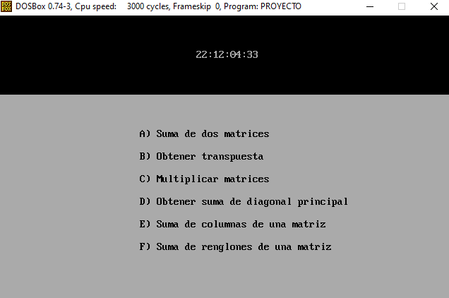
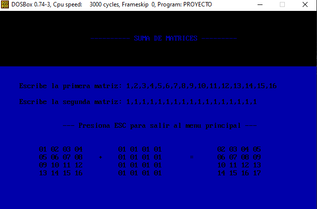
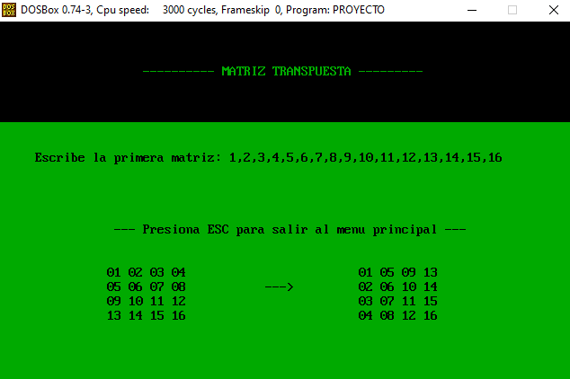
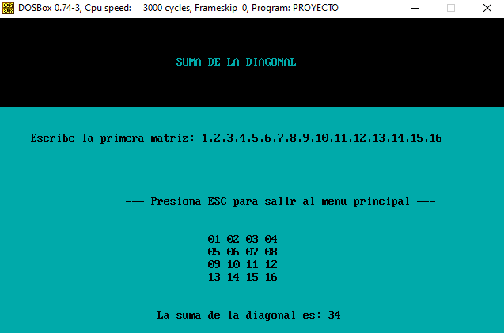
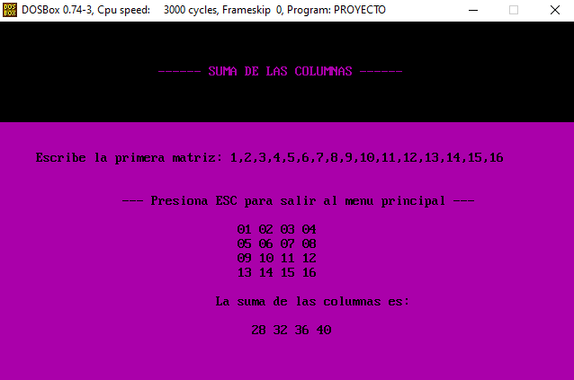
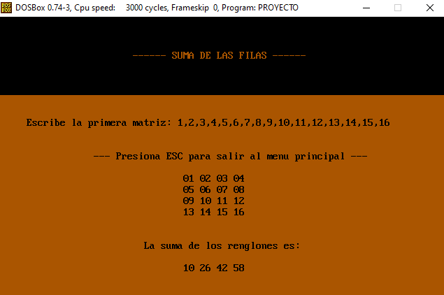

# Menú Operaciones con Matrices 4x4 (ASM)

**Nota:** Este proyecto se hizo con la ayuda de ***Debug*** para emular el entorno de programación en **x86**.

## Objetivos

- Practicar las bases de la computación a uno de sus ***niveles mas bajos*** a través de registros, loops y saltos, combinado con la lógica de programación necesaria para ahorrar código.
- Recopilar conocimientos mediante el uso de interrupciones en lenguaje ensamblador para una manipulación más comoda a nivel usuario.

## Descripción

Este proyecto es una calculadora de matrices que es capaz de hacer operaciones con matrices 4x4.

### A) Suma de matrices

### B) Matriz Transpuesta

### C) EN MANTENIMIENTO

### D) Suma de la diagonal

### E) Suma de columnas

### F) Suma de filas

## Funcionamiento

Al momento de elegir la opción deseada en el menú debes ingresar cada número de tu matriz separa con comas. 

### Ejemplo
**Ingresa la primera matriz:** 1,2,3,4,5,6,7,8,9,10,11,12,13,14,15,16
  
***Nota:** Solo acepta número de hasta dos cifras.*
  
